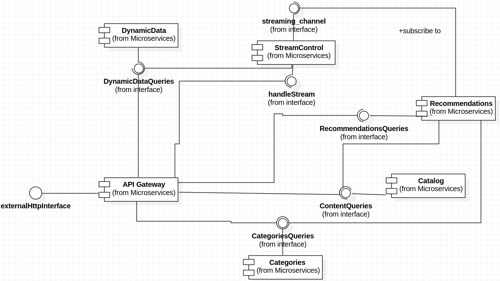
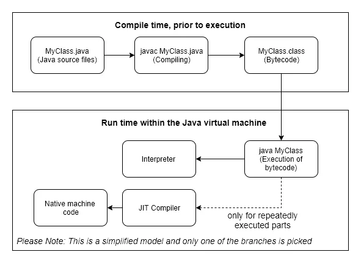
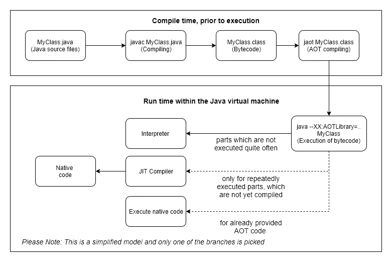
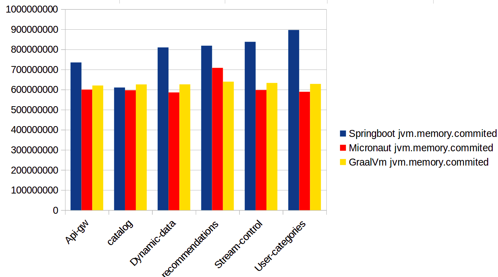
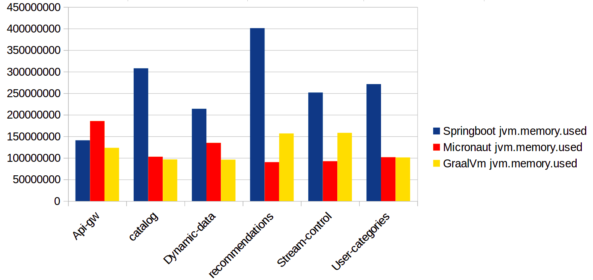
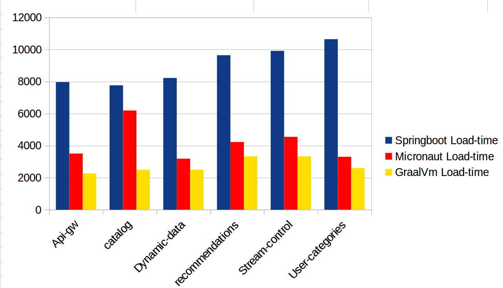

# Comparativa de frameworks Java para el desarrollo de aplicaciones con arquitectura de microservicios desplegados en Kubernetes

## Índice
<!-- toc -->

- [Objetivos iniciales.](#Objetivos-iniciales)
- [Alcance del trabajo.](#Alcance-del-trabajo)
- [Desarrollo de los objetivos.](#Desarrollo-de-los-objetivos)
- [Aplicación.](#Aplicacion)
  * [Esquema general de la aplicación.](#Esquema-general-de-la-aplicacion)
  * [Descripción de los distintos microservicios.](#Descripcion-de-los-distintos-microservicios)
    + [StreamControl.](#StreamControl)
      - [Responsabilidad](#Responsabilidad)
      - [Entradas.](#Entradas)
      - [Salidas.](#Salidas)
      - [Colaboraciones.](#Colaboraciones)
    + [Catalog](#Catalog)
      - [Responsabilidad](#Responsabilidad-1)
      - [Salidas](#Salidas-1)
    + [Categories](#Categories)
      - [Responsabilidad](#Responsabilidad-2)
    + [Recommendations.](#Recommendations)
      - [Responsabilidad](#Responsabilidad-3)
      - [Entradas](#Entradas-1)
      - [Salidas](#Salidas-2)
    + [DynamicData.](#DynamicData)
      - [Responsabilidad](#Responsabilidad-4)
      - [Entradas y Salidas](#Entradas-y-Salidas)
    + [ApiGw.](#ApiGw)
      - [Responsabilidad.](#Responsabilidad-5)
- [Plataformas.](#Plataformas)
  * [Springboot: Standard de facto.](#Springboot-Standard-de-facto)
  * [Micronaut: New kid on the block.](#Micronaut-New-kid-on-the-block)
- [Comparativa de características.](#Comparativa-de-caracteristicas)
  * [Documentación.](#Documentacion)
  * [Comunidad](#Comunidad)
  * [Soporte para 3pp.](#Soporte-para-3pp)
  * [Soporte para cloud.](#Soporte-para-cloud)
  * [Facilidad para el desarrollo/testing.](#Facilidad-para-el-desarrollotesting)
  * [Resumen](#Resumen)
- [GraalVm](#GraalVm)
  * [¿Qué es GraalVM?](#Que-es-GraalVM)
  * [Compilación nativa usando GraalVM](#Compilacion-nativa-usando-GraalVM)
- [Comparativa en performance.](#Comparativa-en-performance)
  * [Memoria.](#Memoria)
  * [Velocidad de Arranque.](#Velocidad-de-Arranque)
- [Conclusiones y siguientes pasos.](#Conclusiones-y-siguientes-pasos)
  * [¿Es una alternativa actualmente? ¿Y en un futuro próximo?](#Es-una-alternativa-actualmente-Y-en-un-futuro-proximo)
  * [¿Existen otras posibilidades a tener en cuenta?](#Existen-otras-posibilidades-a-tener-en-cuenta)
  * [¿Cómo esta afrontando esto SpringBoot?](#Como-esta-afrontando-esto-SpringBoot)
- [Enlaces y contenido del proyecto.](#Enlaces-y-contenido-del-proyecto)

<!-- tocstop -->

## Objetivos iniciales.
  Tal y como se detallaba en el anteproyecto, los objetivos para este trabajo se resumían básicamente en comparar la viabilidad, así como las ventajas y posibles inconvenientes, que los nuevos frameworks de desarrollo de aplicaciones, nacidos específicamente para plataformas cloud, pudieran presentar con respecto a los frameworks ya existentes adaptados para el cloud.
  En concreto para la realización del trabajo se eligió Springboot [^1] como framework nacido antes de la existencia del cloud y adaptado para el y Micronaut [^2] como framework "cloud native".

  La comparativa pretendía tomar en cuenta tanto aspectos de desarrollo y testing así como métricas de los distintos elementos, para poder comprobar si, como el framework Micronaut promete, la performance de su framework es superior.

## Alcance del trabajo.
  Debido a las limitaciones de tiempo ha resultado imposible realizar la composición completa de la aplicación y por tanto tomar el número de medidas de performance que habría sido deseable, más concretamente aquellas relacionadas con el comportamiento dinámico del sistema.
  Sin embargo el proceso de desarrollo así como las medidas tomadas, han permitido hacerse una idea sólida de la situación actual en la que se encuentra el desarrollo de ambos frameworks, haciendo posible obtener unas conclusiones válidas.

## Desarrollo de los objetivos.
  Para poder hacerse una idea de las facilidades e inconvenientes que cada uno de los frameworks podía presentar, así como para poder tomar una serie de medidas suficientemente significativas, se hacía necesario desarrollar una aplicación con una arquitectura de microservicios que fuese a la vez, lo suficientemente sencilla para poder realizar su desarrollo utilizando ambos frameworks en el tiempo disponible y lo suficientemente realista como para que las problematicas a enfrentar permitiesen hacerse una idea de la situación actual de los frameworks.

## Aplicación.

  La aplicación elegida para ilustrar este trabajo es completamente ficticia, y se basa en un sistema de control **simplificado** de una plataforma de emisión de películas por streaming.
  La aplicación está formada por multiples servicios que colaboran entre ellos para permitir a un usuario que visualice entre un grupo de contenidos multimedia, con la posibilidad de obtener aquellos que se acerquen más a sus gustos personales, y de ordenar su visualización. 
  Este sistema presenta una interface REST hacia el usuario, suponiendo que existe una aplicación cliente que consumirá dicho interface REST y lo presentará mediante una interface más amigable para un ser humano.
  Tambien supone la existencia de un sistema de visualización de los streams multimedia con el que se comunicará y al que enviar ordenes que resulten en el envío del streaming de video al usuario final.
  La aplicación está pensada para ser utilizada sobre *kubernetes*.
### Esquema general de la aplicación.
  En el siguiente diagrama de contexto podemos ver las interacciones de la aplicación con los sistemas externos antes mencionados:
  

### Descripción de los distintos microservicios.
  La aplicación está formada por seis microservicios, cada uno de ellos con una responsabilidad única en el sistema.
  En el siguiente diagrama podemos ver los microservicios y los interfaces que proveen y consumen cada uno de ellos.
  

  Seguidamente se van a detallar los microservicios que forman la aplicación mostrando principalmente la responsabilidad de cada uno de ellos dentro del sistema, asi como las distintas tecnologías utilizadas para su realización, dato importante a la hora de valorar más adelante el soporte de que ambos frameworks disponen para relacionarse de manera sencilla con la ingente cantidad de software que puebla el ámbito del cloud.

  En el siguiente esquema podemos ver el modelo de datos de la aplicación, sirva como referencia pues se hablará de estos elementos en las descripciones de los microservicios.
  

#### StreamControl.
  Es el punto de comunicación de la aplicación con el sistema externo de visualización de contenidos multimedia.

##### Responsabilidad
  Envía comandos a dicho sistema para que los contenidos se vuelquen mediante streaming a los dispositivos de los usuarios.
  Guarda una relación de qué contenido está visualizando cada usuario en cada uno de sus dispositivos en un momento dado, para ello utilizar una base de datos *Redis*.
##### Entradas.
  Presenta un interface RPC atendiendo a los comandos PLAY,PAUSE y STOP, para ello utiliza *RabbitMq RPC.*

##### Salidas.
  A parte de los comandos al sistema externo, este microservicio publica notificaciones sobre cada uno de los comandos ejecutados sobre un stream multimedia, para ello utiliza *RabbitMq*

##### Colaboraciones.
  Realiza queries al microservicio [DynamicData](#DynamicData) para poder relacionar un identificador de dispositivo (deviceId) activo en ese momento con un usuario determinado.

#### Catalog
  Es la base de datos de contenidos de la aplicación.
  Contiene una relación de la caracterizacion de todos los contenidos que existen, han existido o existirán en el sistema, para lo cual utiliza una base de datos *Redis*.
  Cada contenido tiene, entre otras cosas:
    - Información que relaciona el identificador del contenido (contentId) con el identificador del stream multimedia correspondiente en el sistema externo de streaming.
    - Una lista de palabras clave, tags, que permiten agrupar los contenidos según distintas características.
    - Un estado, de manera que los contenidos puedan ser introducidos en el sistema sin que eso los haga accesibles a los usuarios.
    - Un tag especial que asigna el contenido a una "categoria de usuario", demanera que se pueda filtrar qué contenido es accesible para cada tipo de usuario

##### Responsabilidad
  El microservicio permite realizar búsquedas sobre la base de datos de contenido utilizando como criterio cualquiera de sus elementos característicos.

##### Salidas
  Presenta un interface REST que permite la realizacion de queries y de comandos.

#### Categories
  Mantiene una relación de las posibles "Categorías" a las que puede pertenecer un determinado usuario, por ejemplo Oro,Plata,Bronce ... Estas categorías permiten definir qué contenidos serán accesibles para el usuario.
  También dispone de una relación de "Paquetes" que puede contratar un usuario y que le darán acceso a nuevos contenidos definidos por un grupo de etiquetas.
  Todo usuario tiene que pertenecer a una categoria.
  Un usuario puede tener cualquier número de paquetes contratados, incluido ninguno.

##### Responsabilidad
  La responsabilidad de este microservicio es mantener la información de qué paquetes tiene contratado un usuario dentro de los disponibles, y a qué categoría pertenece dicho usuario.

  Permite filtrar una lista de contenidos para un usuario determinado, teniendo en cuenta la información sobre categoría y paquete que tiene de él.

#### Recommendations.
  Mantiene una relación de los distintos tipos de contenidos visualizados por un usuario determinado de manera ponderada, es decir de los tags de los contenidos que visualiza cada usuario asignandoles un peso. También contiene dicha relación para todo el sistema. Para ambas utiliza una base de datos *Redis* .

##### Responsabilidad
  Permite obtener información sobre los tipos de contenidos que más visualiza un usuario determinado, así como aquellos mas visualizados en el sistema. Con estos datos pueden realizarse otro tipo de operaciones tanto de presentación de nuevos contenidos al usuario en función de lo que suele ver, como de gestión de contenidos, añadir nuevos contenidos de aquellos tags que mas suelen verse en el sistema.

##### Entradas
  La información la obtiene de las notificaciones que envía el microservicio StreamControl, para ello utiliza *RabbitMq*.

##### Salidas
  Presenta un interface REST donde permite la realización de queries para usuarios o para todo el sistema.

#### DynamicData.
  Existen datos que son necesarios mantener mientras los usuarios están utilizando el sistema, pero que no tiene sentido mantener en una persistencia. Este microservicio se encarga de mantener dichos datos. 

##### Responsabilidad
  En el caso que nos ocupa, un mismo usuario puede tener al mismo tiempo más de un dispositivo funcionando, y no tienen porque ser siempre los mismos dispositivos. Este microservicio se encarga de mantener la informacion sobre que dispositivos pertenecen a que usuario. 
  Se basa en la suposicion de que el cliente enviará el identificador de dispositivo, cuando este realizando operaciones.

##### Entradas y Salidas
  Presenta un interface REST que permite realizar queries sobre la información de los usuarios y de los dispositivos activos.

#### ApiGw.
  Es la fachada de entrada al sistema. Todas las interacciones de los usuarios pasan por este microservicio quien después distribuye las peticiones necesarias a los demas microservicios para satisfacer los comandos de los usuarios.

##### Responsabilidad.
  Al ser el frontal de entrada a la aplicación es el encargado de autenticar y autorizar a los usuarios. Se utiliza para ello *Json Web Token* y una base de datos *Redis* con la información de credenciales de los usuarios. Evidentemente esta no es una solución utilizable en una instalación real por tener una seguridad muy deficiente, pero para el trabajo que nos ocupa y con los recursos disponibles era la mejor opción.

## Plataformas.
### Springboot: Standard de facto.
  [Springboot](https://spring.io/projects/spring-boot) es un framework que toma como base el framework Spring y define una serie de configuraciones y componentes por defecto para hacer que la configuración del framework sea más sencilla y rápida.
  Spring, y Springboot, es actualmente uno de los frameworks de java más utilizados en el desarollo de aplicaciones y, con su proyecto ["Spring Cloud"](https://spring.io/projects/spring-cloud) ha intentado adaptarse al nuevo paradigma de ejecución de aplicaciones en la nube, con bastante exito. Por estas razones se decidió tomar este framework como "referencia de medida" a la hora de valorar los nuevos frameworks.

  En general, podemos decir que Springboot tiene soporte para casi cualquier software de terceros que tenga cierta utilización en el entorno cloud, su documentación es ingente y extensa, y tiene una configuración asequible, aunque un tanto verbosa a veces.

  Para la realización de este trabajo se ha utilizado la versión 2.1.4.RELEASE de Springboot, ya que era la última con GA en el momento de comienzo del proyecto.

### Micronaut: New kid on the block.
  Es un nuevo framework para la creación de aplicaciones que nace directamente enfocado hacia la creación de aplicaciones cloud, tanto microservicios como "serverless".
  Según su propia página web, la intención de [Micronaut](https://micronaut.io) es crear un framework moderno que facilite el desarrollo de este tipo de "nuevas" aplicaciones, así como el de mejorar tanto los tiempos de arranque como el consumo de memoria tradicionalmente altos de este tipo de frameworks que hacen un uso extensivo e intensivo de la reflexión para implementar la [Inyección de dependencias](https://es.wikipedia.org/wiki/Inyecci%C3%B3n_de_dependencias) y la [Inversión de control](https://es.wikipedia.org/wiki/Inversi%C3%B3n_de_control).
  También ofrece soporte para crear aplicaciones basadas en la [máquina virtual de Graal](https://www.graalvm.org/) lo que podría mejorar drasticamente las medidas de performance.

  El framework aún está en sus primeras fases, su primer Milestone fué en Mayo de 2018, mientras que su primera versión oficial se dió en Octubre de ese mismo año.

  Para la realización de este trabajo se ha utilizado la versión 1.1.1

## Comparativa de características.

  Además de la comparación de las características de memoria y velocidad de carga de la aplicación, otro de los puntos importantes a dirimir con este trabajo es si el framework Micronaut resulta, a día de hoy, una alternativa viable para el desarrollo de aplicaciones.

  Realizar una comparativa semejante no es sencillo. Después de haber trabajado durante horas con ambos frameworks desarrollando en ambos la misma aplicación, se tiene una serie de sensaciones sobre la facilidad y los inconvenientes de cada uno de los frameworks, pero resulta complicado diseccionar estas sensaciones y apuntalarlas con datos.

### Documentación.
  Uno de los pilares para poder trabajar con facilidad con frameworks tan complejos como estos, en términos de cantidad de "magia" que tienen entre bambalinas, es la documentación.
  Una buena documentación debería: 
    - Estar actualizada
    - Estar organizada siguiendo las mismas versiones que la propia aplicación.
    - Tener un punto único de entrada.
    - Ser completa en lo referente a ejemplos de utilización en diversas situaciones
    
  Desgraciadamente ninguno de los dos frameworks a examen cumplen estas características, sin embargo cada uno las incumple de distinta manera [^3].

  **Springboot**, al ser un framework con una larga trayectoria, tiene una extensa documentación, demasiado extensa quizás. El problema reside en la cantidad de fuentes que existen y en lo poco organizadas que estas están. Buscar cómo realizar cualquier cosa para este framework es un perfecto ejemplo de "infoxicación"[^4]. Lo más probable es que encontremos al menos cinco maneras distintas de solucionarlo, pero sin referencias a cual de ellas podría ser mejor, o para que versiones de Springboot fueron propuestas estas soluciones.
  Todo esto convierte en un proceso largo, tedioso el encontrar la manera que tiene el framework de ofrecer solución a un nuevo problema, y la mayoría de las veces termina en frustración, al no tener la seguridad de haber encontrado la mejor manera de solucionarlo.

  **Micronaut** por otro lado, al ser un proyecto bastante joven, carece de una gran cantidad de documentación, aunque la que tiene está bien organizada, bien versionada, escrita de manera sencilla y con ejemplos. Sin embargo el problema llega por esa "sencillez". La documentación, en la mayoría de las ocasiones, solo cubre los casos más sencillos, de manera que, en cuanto queremos hacer algo que sea un tanto más complejo, nos encontramos en tierra de nadie y solos ante el peligro.
  La aplicación que ha servido para ilustrar este trabajo no es tan complicada como lo podría ser una aplicación profesional real, sin embargo se han dado multiples situaciones a lo largo del desarrollo, en los que la documentación no cubría en absoluto los casos de uso, teniendo en esos casos que recurrir a la investigación del código del framework.

  En definitiva, ninguno de los dos frameworks brilla en el apartado de documentación. Con Springboot resulta más probable encontrar una solución al problema, pero es dificil decir si esta es la más adecuada, y es muy probable que no esté bien explicada, lo que acerca muchas veces a la sensación de estar programando con piezas de Lego. Por otro lado Micronaut, al cubrir solo los casos más sencillos, deja muchas veces al desarrollador en una situación complicada, en la que solo puede buscar por si mismo si es posible realizar lo que necesita mirando el código del framework, o buscar un camino alternativo. Esto puede acharcarse a la juventud del proyecto, por lo que si continúan manteniendo la documentación bien organizada y la amplían adecuadamente puede que en un futuro esto se subsane. 

### Comunidad
  Otro de los salvavidas cuando se buscan soluciones en el proceso de desarrollo es preguntar a la comunidad existente de desarrolladores. 
  En este caso nos encontramos en una situación parecida a la comentada en el apartado de [documentacion](#Documentacion): La comunidad de usuarios de SpringBoot es mayor y por tanto existe mejores posibilidades de obtener ayuda, mientras que la base de usuarios de Micronaut es aún limitada.
  Una pequeña ventaja a comentar con respecto a Micronaut es el establecimiento de un canal de comunicación, mediante la herramienta "gitter"[^5], donde poder plantear las preguntas directamente a los desarrolladores principales del framework así como a otros usuarios. Es una buena iniciativa que además provee de un punto de entrada para las preguntas, sin embargo por ahora existen muchas mas personas planteando preguntas que personas resolviéndolas, por lo que por ahora no es una herramienta útil.

### Soporte para 3pp.
  En un entorno de ejecución distribuido como es el cloud se plantean muchos nuevos retos que no existían en los entornos tradicionales cuando toda la aplicación consistía en un único monolito corriendo en un servidor localizado. Para dar solución a estos nuevos problemas de una manera sencilla y uniforme, de manera que los desarrolladores puedan centrarse en el desarrollo de la "lógica de negocio" de su aplicación, que es lo que realmente aporta valor, se han adoptado muchos elementos software de terceros, de manera que una parte importante del desarrollo de una aplicación consiste en integrar esta con los elementos proveedores de dichas soluciones. 
  Para que esto sea más sencillo el framework que utilicemos tiene que proporcionarnos una manera fácil y directa de integrarlos, a la vez que permite que tengamos el control sobre como deseamos que estos elementos se comporten dentro de sus especificaciones.

  **SpringBoot** ofrece una integración con casi cualquiera de los elementos software 3PP más utilizados actualmente en el desarrollo de aplicaciones para el cloud. Además el soporte ofrecido es, en su mayor parte, completo, pudiendo trabajar en casi cualquier  configuración que el elemento permita.

  **Micronaut** por otro lado tiene muchas más limitaciones a la hora de ofrecer soporte para elementos de terceros, y en muchos de los caso el soporte que ofrece es básico y limitado solo a un tipo de operaciones o configuraciones de dicho elemento. Como contrapartida decir que, en los casos en los que Micronaut si ofrece soporte para un elemento de terceros, la configuración de este suele ser menos verbosa y mas directa que su contrapartida en Springboot.

  En el caso de la aplicación que ilustra este trabajo, la elección de los elementos de terceros estuvo siempre dirigida por las limitaciones de Micronaut, ya que desde un principio se vió que este framework daba soporte a menos elementos.
  Como ejemplo mencionar que, en la fecha de desarrollo de este trabajo, Micronaut no ofrece soporte para la carga de configuración mediante los "configmaps" de *kubernetes*, y solo ofrece un soporte limitado al servicio de "service discovery" de dicha plataforma, por lo que, a pesar de desarrollar una aplicación para una plataforma que dispone de semejantes servicios de manera nativa, hubo de utilizarse *Consul* tanto para "service discovery" como para la carga de configuración distribuida.

### Soporte para cloud.
  **Micronaut** dice en su página web oficial ser "NATIVELY CLOUD NATIVE", intentando así distinguirse de los frameworks como **SpringBoot** que nacieron antes de la existencia del cloud y que se han ido adaptando a él.
  La realidad es que, a parte del soporte para 3PP comentado anteriormente, si que hay ciertos elementos nativos en el framework que parecen ciertamente orientados a la creación y ejecución de aplicaciones en el cloud como podría ser: cliente http declarativo, anotaciones nativas para "overload protection" y "circuti breaking", etc. Sin embargo todo esto es conseguible en SpringBoot, por lo que tampoco resulta en un elemento decisivo a favor de **Micronaut**

### Facilidad para el desarrollo/testing.
  A parte de los datos que se han ido aportando en los apartados anteriores, existe también una sensación subjetiva de dificultad que se da a la hora de desarrollar una aplicación en un framework determinado.
  En el caso de la aplicación que ilustra este trabajo la sensaciones fueron que, siempre que el soporte de Micronaut no se interponía, el desarrollo era más sencillo y menos verboso que su contrapartida en Springboot, es decir hay que implementar menos código para obtener el mismo resultado. Como contrapartida cuando estos mecanismos por defecto no se ajustan a las necesidades de la aplicación a desarrollar, los mecanismos de control para cambiar el comportamiento son en ocasiones insuficientes y/o complicados de implementar. 

### Resumen
  En definitiva, la sensación general es que el framework Micronaut aún presenta muchas carencias como para ser considerado una alternativa seria a SpringBoot, sin embargo, si eliminamos aquellas fallas achacables a su falta de madurez, la situación mejora considerablemente, por lo que, si continúan realizando un buen trabajo, podría cambiar este balance en un futuro cercano.

## GraalVm

### ¿Qué es GraalVM?
  Hasta ahora **HotStpotJVM** era la principal máquina virtual de java mantenida por Oracle. Esta máquina virtual se encarga, principalmente, de interpretar y ejecutar código en "java bytecode" (`.class`), y analiza continuamente el código en ejecución para identificar aquellas partes que se ejecutan muy a menudo y compliarlas a código nativo para mejorar así el performance.
  En la siguiente figura podemos ver un workflow simplificado de como funciona esta "java VM"

  

  La conversión del código a nativo se realiza en "runtime" de manera que no es viable hacerlo con todo el código pues esto impactaría a la ejecución de la aplicación. La JVM decide que elementos son compilados. El problema de esta aproximación es que, el JIT puede tardar mucho en "calentarse" y puede que determinadas partes del código nunca se lleguen a compilar a nativo.

  Con la aparición del Java 9 se creó un "ahead-of-time compiler" en el JDK. A este proyecto se le dió el nombre de Graal.
  Este AOT-compiler permitía la genración de código nativo antes de la ejecución, haciendo innecesarios los JIT. Esto derivó en una mejora del tiempo de ejecución, ya que el JIT no tenía que interceptar la ejecución de la aplicación en ningún momento.
  En la siguiente figura podemos ver un workflow simplificado del funcionamiento del código compilado mediante este AOT compiler.

  

  Basándose en Graal Oracle desarrollo la GraalVM, desarrollada en java, y que permite compilar a código nativo tanto aplicaciones en java como en otros lenguajes que corren sobre la máquina virtual de java.

### Compilación nativa usando GraalVM
  La documentación de **Micronaut** sobre como compilar una aplicación para GraalVM es más bien sucinta. En [este](https://docs.micronaut.io/latest/guide/index.html#graal) apartado de su documentación hay una pequeña guía que ilustra como "preparar" una sencilla aplicación para ser compilada usando la GraalVM. Desgraciadamente esta documentación, como casi toda la de este framework, peca de exceso de sencillez, por lo que no sirve más que para aplicaciones muy sencillas.

  Si bien Micronaut dice ser compatible con GraalVM, deja bien claro que cualquiera de los elementos 3PP que se utilicen deben ser compatible con esta tecnología por su propia cuenta. Como resulta casi imposible no utilizar elementos de terceros para casi cualquier proyecto en el cloud que sea mas complejo que un simple "hola mundo", y la compatibilidad con la máquina GraalVM no es algo demasiado extendido por el momento, resulta complicado conseguir generar una máquina nativa de cualquier microservicio.

  En el caso que nos ocupa resultó imposible realizar una imagen nativa, sin ningún error, de los microservicios utilizados, teniendo que recurrir a la "fallback image" para poder tomar algunas lecturas de datos.

## Comparativa en performance.

### Memoria.
  En las siguientes gráficas podemos ver las diferencias de consumo de memoria de la máquina virtual de java en las distintas plataformas.

  

  

  Como se puede ver claramente en las gráficas, si exceptuamos el curioso caso del `api-gw`, las implementaciones de todos los microservicios hechas utilizando **Springboot** *consumen sensiblemente más memoria que su contrapartida* realizada utilizando **Micronaut**, llegando en ocasiones a una relación de 4:1. 

  Mención a parte merecen las medidas de memoria tomadas utilizando las imagenes nativas de GraalVM. En estos casos, el consumo de memoria no parece significativamente inferior, como debería ser, pero esto puede ser debido al hecho, comentado con anterioridad, de no haber podido obtener una imagen "limpia" de ninguno de los microservicios, por lo que estas medidas deberían de ser tomadas con cierto excepticismo.

  A la vista de esta información podemos comprobar que las afirmaciones de que el framework **Micronaut** realiza un mejor uso de los recursos podrían estar fundados.

### Velocidad de Arranque.
  En la siguiente gráfica se puede ver los tiempos de arranque de los distintos microservicios en las diferentes plataformas.
  

  En estas gráficas salta a la vista que el tiempo de arranque de las implementaciones de los microservicios realizadas con **Springboot** es netamente  superior a las de las implementaciones realizadas con **Micronaut**, si bien en este caso la relación no parece ser tan grande como lo era en la gráfica de memoria.

  De nuevo, las medidas realizadas para las imagenes nativas de GraalVM, si bien en este caso parecen más coherentes con lo que deberían ser, han de ser tomadas con cierto excepticismo por las razones ya mencionadas.

## Conclusiones y siguientes pasos.

  El principal objetivo de este trabajo consistía en tomar el pulso al nuevo framework de desarrollo de aplicaciones **Micronaut** y comprender si este era, a día de hoy una alternativa razonable al establecido **Springboot**, y si presentaba mejoras sobre a la hora de realizar aplicaciones basadas en el cloud, este por haber sido concebido nativamente para este tipo de aplicaciones.

  ### ¿Es una alternativa actualmente? ¿Y en un futuro próximo?
  Aunando toda la información obtenida a lo largo del tiempo de desarrollo de este proyecto la sensación es que Micronaut **aún** no es una alternativa viable salvo para proyectos muy sencillos que solo requieran una integración básica con algunas de las herramientas para las que este framework presenta soporte, ya que en cuanto se intenta realizar una utilización un poco mas exigente de alguna de ellas, el framework comienza a presentar vacíos y fallas complicadas de subsanar.
  Ahora bien, este framework presenta una buena utilización de recursos, una documentación ordenada, versionada y localizada en un solo punto y una "facilidad de uso" para el desarrollador bastante interesantes, por lo que, si el bajo número de desarrolladores activos no lo impide, podría ser una buena alternativa en un tiempo razonablemente corto.

  ### ¿Existen otras posibilidades a tener en cuenta?
  [Quarkus](quarkus.io) es otro framework de similares características a Micronaut y que se presenta a sí mismo como una alternativa rápida, tanto en ejecución como en desarrollo, a Springboot. 
  A pesar de no haber podido probar este framework, es un proyecto auspicidado por la  empresa `RedHat` por lo que seguramente deba ser tomado en cuenta a la hora de decidirse por un framework de desarrollo.

  ### ¿Cómo esta afrontando esto SpringBoot?
  Las aplicaciones Spring, frawework en el que se basa Springboot, no permitían crear una imagen nativa utilizando GraalVM, sin embargo Spring está incorporando soporte experimental[^6] para esto es sus nuevas versiones, por lo que seguramente en sus próximas versiones esto sea una realidad y no sea necesario utilizar uno de estos nuevos frameworks para poder tener las ventajas que ofrece GraalVM.
  ¿Qué puede significar esto para los frameworks como Micronaut y Quarkus? Pues segurmente una pérdida de inercia en su adopción, ya que una de los ganchos que podrían hacer que fuesen considerados como plataforma para nuevos desarrollos por encima de Springboot podría disiparse.

## Enlaces y contenido del proyecto.

  Todo el código desarrollado para este trabajo se encuentra en el repositorio https://github.com/jlojosnegros/master_upm_tfm. 
  En dicho repositorio hay tres directorios, cada uno de ellos con la implementación de los microservicios en una de las plataformas.

[^1]: https://spring.io/projects/spring-boot
[^2]: https://micronaut.io/
[^3]: http://www.frasedehoy.com/frase/2435/todas-las-familias-felices-se-parecen-entre-si-las-infelices-son-desgraciad
[^4]: https://en.wikipedia.org/wiki/Information_overload
[^5]: https://gitter.im/micronautfw/
[^6]: https://github.com/spring-projects/spring-framework/wiki/GraalVM-native-image-support